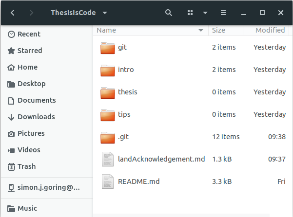
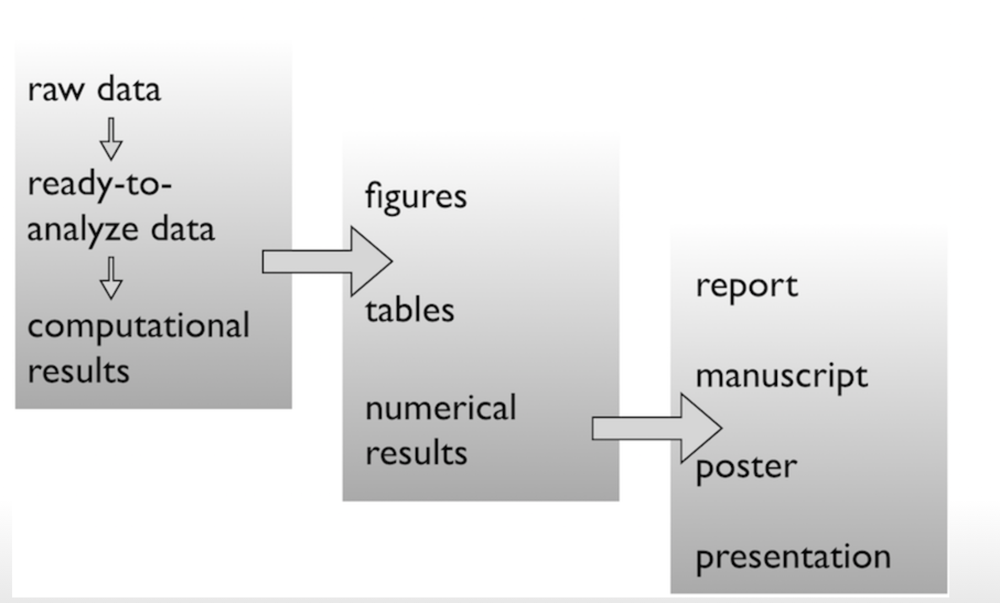

# What is Version Control?

Version Control refers to a class of systems responsible for monitoring changes to objects on your computer. These can be documents, software or images. Working with Version Control means that you can recover files or re-use specific file changes if you accidentally destroy a file or lose it.

At the heart of most modern version control is `git`. `git` is the "language" we use to communicate with GitHub. Although `git` is mostly used for code, it can be used to manage any other type of file, such as Word documents. Think of it as a filing system for every draft of a document.

`git` treats each line in a document as an individual element. When any line is changed, `git` keeps track of the file, the line or lines that were changed, and what the new version of that file looks like. In general this is represented as _insertions_ and _deletions_, but in reality, `git` stores snapshots of your files whenever they change, and basically functions as a filesystem of its own.

## An Example of Changes

I've written a really basic text document:

```
Here is line one
Now this is line two
```

Now, I make (and save) a change:

```bash
Here is line one
Here is line two
```

To `git`, this change looks like:

```bash
Here is line one
- Now this is line two
+ Here is line two
```

`git` tells us we have deleted the line `Now this is line two` and inserted the line `Here is line two`. But, in the back end of the system, `git` now has two versions of the same file, the original and the new version, and presents us with the places these two files differ. [The `git` documentation](https://git-scm.com/book/en/v2/Getting-Started-What-is-Git%3F#what_is_git_section) gives you a much fuller picture of how this all works.

So why use `git`?

## Why use Version Control?


Here are some things that can happen while you're working on code, or a paper:

- You've been working on a figure, and suddenly the plot stops working the way you expected, but you've made a few changes and don't know which one caused the problem.
- You got rid of part of your analysis but now realize you need it back.
- You are collaborating with a partner and want to see changes they've made to the code.
- You are working with a partner and want to make changes to the same files at the same time.
- You've got 10 files called `final`.
- You lost all your files.
- You want to know why you (or someone else) made certain changes.

## A (very) Brief Introduction to `git`

As indicated above, `git` records changes to files. It does this in a **repository**. A repository is a folder (or set of nested folders) that are being tracked. This is usually your project folder, along with a hidden folder (called `.git`) in that project folder. So you might have a folder that looks like this:



This was maybe a bad example, since there is already a folder in here called `git`, which contains this article, but you can see there's also a `.git` folder that contains 12 items. These items include a record of all the changes made in the repository so far, as well as some other utilities that can be associated with a `git` repository.

In general, you want a repository to have one purpose. You could, if you were totally crazy, have a repository that tracked all your document folders, but this would be unwieldy. It's better to have a repository for each project.

### How `git` works

`git` started out as a command-line tool. The general workflow was that:

1. We would `git init` to initialize a repository. This would create the neccessary folder to track the project changes.
2. Once changes had been made in a repository (you've added a file, made edits to an existing file) you would `git add` them to _stage_ those changes, in preparation for adding the changes to the repository.
3. Once you had staged a set of related changes, you would `git commit` those changes with some message, indicating what had been done. The commit message is intended to be brief, but descriptive, so other people (and future-you) can understand why the changes were made. You can reload the [`whatthecommit` bad message generator](http://whatthecommit.com/) a few times to see some less-than-helpful messages.
4. Repeat 2 & 3 until you're done with the project.

As projects get more complex, and particularly, as more people get involved, we begin to see things like **branches** and **forks** appear, and we learn about **conflicts**.

## An Introduction to GitHub

[GitHub](http://github.com) is a hosting service for `git` repositories. GitHub has a number of other features as well, particularly `Issues` and `Project` management tools. `git`is the command line tool, but GitHub provides a web and desktop graphical interface.

Beyond managing and keeping versions of documents under control, there are other reasons for using the `git`/Github version control system:

- Github (website) can act as a back-up for files housed there
- Github can be used to host websites/blogs
- Github has a fantastic search functionality

# What is a repository?

We have said that GitHub is a repository hosting service. But what is even a repository? A repository or a "repo" is a directory or storage space where your projects can live. It can be local to a folder on your computer, or it can be a storage space on GitHub. You can keep code files, text files, image files inside a repository.

## What are important pieces in a repository (Introducing the Template keywords etcetera)

When making a repository, there are some things that you should keep in mind:

- Make sure your repository is well documented. This means comments throughout, readable code and a brief summary at the top of files to answer who wrote it, when it was written and what it does.

- Use a `README.md` file at the root of your repository where you document the basics of the project you are working on. Use this file to also explain what the file structure looks like and what files or directories contain.

- If you are going to be collaborating with others, write a [Code of Conduct](). A code of conduct defines standards for how to engage in a community. It signals an inclusive environment that respects all contributions. It also outlines procedures for addressing problems between members of your project's community.

- Public repositories on GitHub are often used to share open source software. For your repository to truly be open source, license it so that others can enjoy it. MIT License is one of the most common used. It is a simple permissive license with conditions only requiring preservation of copyright and license notices.

- "A place for everything, everything in its place". File organization is crucial against chaos. Make a file's name and location VERY INFORMATIVE about what it is, why it exists, how it relates to other things. The more things are self-explanatory, the better.



- Names **matter**. When naming your files, remember that you want to make sure that:

  - They are _machine readable_
  - They are _human readable_
  - They play well with default ordering - order files either chronologically or logically.

    Examples of bad names:

    - myabstract.docx
    - Joe's Filenames Use Spaces and Punctuation.xlsx
    - figure 1.png
    - JW7d^(2sl@deletethisandyourcareerisoverWx2*.txt

    Examples of good names:

    - 2014-06-08_abstract-for-sla.docx
    - joes-filenames-are-getting-better.xlsx
    - fig01_scatterplot-talk-length-vs-interest.png
    - fig02_histogram-talk-attendance.png
    - 1986-01-28_raw-data-from-challenger-o-rings.txt

- Commit to `git`every time you work on the project. When you commit, make your commit messages meaningful!

- When creating a repository, you have to think about your future users. You should be able to walk away from the project and come back to it a year later and resume work fairly quickly. Other people should be able to figure out what you did and how to continue your work.

Sounds complicated? Take a look at this template to help you out: [Throughput Template](https://github.com/throughput-ec/Template)
