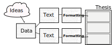
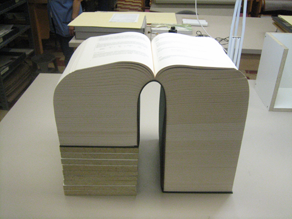
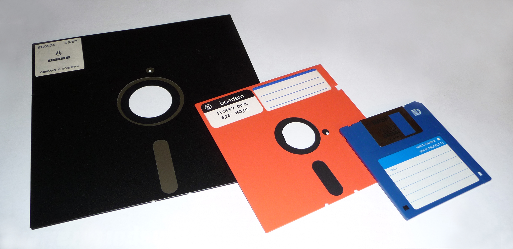

## What is a Thesis?

--------------------------------------------------------------------------------

## A Thesis is

ideas + data + text + formatting

--------------------------------------------------------------------------------

## A Thesis is **Ideas**

**IDEAS** + data + text + formatting

- We have expectations and hypotheses that we aim to test
- Our project design is based on assumptions

  

--------------------------------------------------------------------------------

## A Thesis is **Data**

ideas + **DATA** + text + formatting

- Data is the product of experimental design and has constraints
- Data collection and processing is part of a workflow

  

--------------------------------------------------------------------------------

## A Thesis is **Text**

ideas + data + **TEXT** + formatting

- Text depends on results from analysis
- Text is structured, ordered and order has meaning

  

--------------------------------------------------------------------------------

## A Thesis is Formatting

ideas + data + text + **FORMATTING**

- Formatting transforms text and gives meaning
- Formatting makes it all look pretty
- Your thesis office will not accept a thesis with the wrong formatting

  

--------------------------------------------------------------------------------

## Is A Thesis Like Software?

--------------------------------------------------------------------------------

## Software Is

- ideas (usually sus)
- data (data)
- text (code)
- formatting (styling)

--------------------------------------------------------------------------------

## What can we learn from Software Development

--------------------------------------------------------------------------------

## What can we learn from Software Development

- Working on _Features_
- Testing _Assumptions_
- Building _Workflows_

--------------------------------------------------------------------------------

## Software Development: FEATURES

- Working on _Features_

  - Thesis elements are "units" (a chapter, a statistical test, a graph, a table)
  - A unit can be its own file
  - A unit has expected *inputs* & *outputs*
  - A unit can have versions

--------------------------------------------------------------------------------

## Software Development: ASSUMPTIONS

- Testing _Assumptions_

  - We know things about our data (n = ??, all values are positive)
  - We write things about our results (p < 0.5)
  - Results and data might change as _features_ change

--------------------------------------------------------------------------------

## Software Development: WORKFLOWS

- Building _Workflows_

  - The final thesis is the sum of units
  - Writing units that "just work" takes planning
  - Writing units that "just work" makes changing them easier
  - Writing units that "just work" makes fixing them easier

--------------------------------------------------------------------------------

## Your Thesis is Software

--------------------------------------------------------------------------------

## This Workshop

- An introduction to software tools & concepts
- A resource & community for your ongoing work
- A tool to help you re-think your work going forward

--------------------------------------------------------------------------------

## Key Learning Points

- An introduction to `git` as a tool for version control
- An introduction to markdown (and RMarkdown)
- Data access and processing tricks in documents
- A collection of tips & tricks
