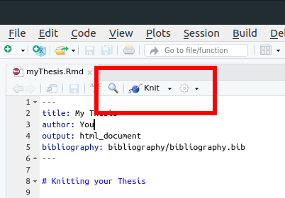

## Your Markdown Thesis - Advantages

- Combine code & text
- Widely used plain-text format
- Output to multiple formats
- Easily tracked with `git`
- Works with many software tools

---------------------------------

## Your Markdown Thesis - Disadvantages

- Disadvantages

  - Can be a pain to edit collaboratively
  - "Some" learning curve

---------------------------------

## Overall Benefits

- Final product is reproducible
- You are awesome
- Can be easily shared, modified & updated

---------------------------------

## Getting Started

---------------------------------

## Start a New RMarkdown File

- Or open our file. . . [see GIF here](../images/gitProjectCropped.gif)

  - Navigate to the [repository for this workshop](https://github.com/throughput-ec/ThesisIsCode)
  - [Fork the repository](https://docs.github.com/en/get-started/quickstart/fork-a-repo) [see video](../images/forkGithub.webm)
  - Start a project from Version Control
  - Link to [ThesisIsCode](https://github.com/throughput-ec/ThesisIsCode)
  - Open the file in `thesis/myThesis_Revised.Rmd`

---------------------------------

## How Do We Write?


---------------------------------

## Main Elements

- Folders!

  - Figures (raw, finished); Code; Data (input/output); Save Google Sheet to file.
  


[image ref](https://martinctc.github.io/blog/rstudio-projects-and-working-directories-a-beginner's-guide/)

---------------------------------

## Main Elements

- YAML header (metadata for the document)
- Markdown formatting
- Fenced code blocks (using backticks)
- Data import
- Analysis
- Conclusions

---------------------------------

## Main Elements - YAML

- YAML Ain't Markup Language
- Tells Pandoc how to render the finished file.

```yaml
---
title: Some title
author: Simon Goring
---
```

---------------------------------

## Main Elements - Markdown

- How you actually apply styles/links &cetera
- Good Markdown Resources:
  - [RMarkdown the Difinitive Guide](https://bookdown.org/yihui/rmarkdown/)
  - [GitHub Markdown Guide](https://guides.github.com/features/mastering-markdown/)


---------------------------------

## Main Elements - Code Blocks

- This is the R part of RMarkdown.  R executes the code and places it inline into the text.

<pre>
Here is writing
```{r}
this <- is(code)
```
Here is writing that uses `r this` result.
</pre>

---------------------------------

## Then `knit` the Document



```bash
Rscript -e "rmarkdown::render('filename.Rmd')"
```

Or, with `bash` (Mac & Linux) you can [build on save](https://gist.github.com/SimonGoring/6110c8539eeb79d310ddd07597b0b05e).

---------------------------------

## Let's all Gaze in Wonder

- We can knit to PDF, HTML, DOCX (and other formats)
- Options depend on options in the `yaml` header (in part)
- RMarkdown `render`:
  - Runs each R blockthe R code
  - Creates a raw Markdown file
  - Replaces code with code results
  - Converts file format to desired output

---------------------------------

## Main Elements - Data Import

- Lets load in our file in `thesis/data/input`:

<pre>
```{r loadData}
table <- read.csv('data/input/GitHubRepos.csv')
```

The table has `r nrow(rows)`.
</pre>
---------------------------------

## How Does it Look?

- Are there errors we can fix?
- We need to check our assumptions
- Formalize them with `assertthat()`

---------------------------------

## Using Assertions

---------------------------------

## Why Use Assertions?

- We want to make sure our text follows from our analysis.

> meaning less than 300 papers about climate. Shocking!

- But is it?

---------------------------------

## Writing Assertions


```r
assertthat::assert_that(climate[[1]]$hits < 300, msg="The hits are greater than 300 now!")
```

- If the assertion fails then the code doesn't `knit` and you have an informative error message telling you why.

---------------------------------

## Summary

---------------------------------

## Summary

- You've created a thesis chapter
