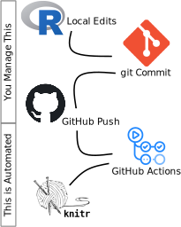

Here are some tips & tricks I've learned along the way to help me get things done:

## R Tips & Tricks

### Working with Slow Functions or Processes

Slow functions and processes can really inhibit `knit`ing. If you're working with something that takes an hour to run, that means it'll take an hour to knit your file. Yikes!

One solution is to do something like this

#### Our Slow Example

So, we have a random function that returns some value plus 12:

```r
slowmedown <- function(x) {
  # Our slow function just sleeps for 12 seconds.
  Sys.sleep(30)
  # And then adds 12 to the result.
  return(x + 12)
}

someCode <- 13
testingResult <- slowmedown(someCode)
```

Lets pretend that's meaningful, and that we'd expect to use it later. This is where we can use our `data/output` folder to our advantage. R can save variables to file in R objects (`RDS`) using the `saveRDS()` function, and then read them back using `readRDS()`.

What we'll do here is use an `if`/`else` check to, first check if thre result of the function has already been saved to file.  If it has, we can load it in.  If it hasn't, we'll run the slow code and save it to file, so that it's faster the next time we run things:

```r
slowmedown <- function(x) {
  # Our slow function just sleeps for 12 seconds.
  Sys.sleep(30)
  return(x + 12)
}

someCode <- 13

filePresent <- file.exists('data/output/slowCode.RDS')

if (filePresent) {
  testingResult <- readRDS('data/output/slowCode.RDS')
} else {
  testingResult <- slowmedown(someCode)
}
```

If, for some reason, you want to re-run the chunk of code, then just delete the `data/output/slowCode.RDS` file. Your code will run smoothly whether or not it's there. It'll just run faster with it there.

You can also use the `cache` option in RMarkdown code chunks (`cache=TRUE`).  To me, this is a bit trickier.  We're being very clear that these objects exist.  With caching you may forget that the objects have been created, and so have less direct control over your output.

## Continuous Integration

### What is Continuous Integration

Continuous Integration is a tool that rebuilds your software (or thesis) over and over again, each time you make a change. We do this to make sure things work the way we expect. It's possible that, as we're working, we have accidentally created variables that we used for debugging (maybe I was testing the code above and wanted to see what would happen if I set `someCode` to `14` and forgot to set it back again). Edits might also cause code to fail if we've gone back and made a change, but haven't actually run the changed code. These might cause our code to run in ways it might not if we were to share it and have someone else run it.

One simple way of doing this yourself is to run your complete code each time you save it. That's a bit time consuming if we had a long script, or were knitting together an entire document.

I have a script [here](https://gist.github.com/SimonGoring/6110c8539eeb79d310ddd07597b0b05e) that works (on Linux computers) to render an RMarkdown document each time it is saved. That way I was able to just reload the webpage each time I saved the Rmd file. It was pretty cool :)

### How to do it?

A much better way to do it is to use something like [GitHub Actions](https://github.com/features/actions). The Actions happen when you do things with your repositories. If you go to the `.github/workflows` folder of this repository you'll see a file called `main.yaml`. It tells GitHub to run a script each time someone pushes to this repository. Pretty cool!



The `main.yaml` file in the ThesisIsCode repository, and the actions that we perform, were modified from the great [`ghactions` package](https://github.com/maxheld83/ghactions). Depending on what your repository aims to do, and what you're expecting as a result (does it just need to run, like a `shiny` app, does it need to output something specific?) you can look into GitHub Actions further.

## Docker

### Improving your workflow with Docker

[Docker](https://www.docker.com/) is a containerization tool. We can think of Docker as another computer inside your computer.  What does this mean? We will make a self-contained computing *environment*, separate from your OS (Mac, Windows, Linux) that will be portable and lightweight. It also makes sure that any program dependencies won't conflict with programs you have running on your computer now, and because you can share the Docker *images*, your collaborators can easily set up a container on their computer with the same settings as yours.

Docker allows us to create *containers*. A *container* is an *instance* of an *image*. A `Dockerfile` defines the contents of the image.  A `Dockerfile` is a plain text file that contains a set of instructions to build an image.  With a valid `Dockerfile` we can run the command `docker build` to create the container on our computer. The image can then be deployed or transported to any platform since it is self-contained and run as a container (`docker run`).

Although you can create your own image, there are pre-built images available from several locations such as [DockerHub](https://hub.docker.com/). Let’s check out the [`Rocker` project RStudio image](https://hub.docker.com/r/rocker/rstudio) to run RStudio (without installing it) from a browser.

The DockerHub page of the Rocker project lists all available Rocker repositories. Let’s pull the `rocker`/`RStudio` image from DockerHub by executing the following command in the terminal:

```bash
docker pull rocker/rstudio
```

This will pull the RStudio image from the Rocker DockerHub repository. We can run a container based on this image by typing the following into the terminal:

```bash
docker run -d -p 8787:8787 -v $(pwd):/home/rstudio -e PASSWORD=yourpasswordhere rocker/rstudio
```

You are now running RStudio inside a Docker container! We need to access the browser to start using RStudio.

You will be required to have username & password credentials.

For username use: rstudio             <- cannot be changed
For password use: yourpasswordhere    <- change this as you wish

What do the `-p` and `-v` flags mean?

* `-v` : A “volume” has been mounted. This means that usually, all work that you did in a container would be lost once the container stopped. This -v will help you save your work in your local machine. $(pwd) means it will be saved in the current working directory.
* `-p` : This is the port that you need to specify where you will be working. Since we specified that we wanted to use port 8787 in our command line, we need to go to:
http://localhost:8787/

(The `-e` flag is a personalized flag defined by the operator, in this case it is to pass a password which is a requirement to run the RStudio image)

Congratulations! You can work in a containerized version of R!

### Why is this useful?

Imagine that you have to run your thesis on a different computer. You would need to download not only R but all the other packages/dependencies that you used for your thesis. With containerization, you could build an image and download that image as needed.

Once you have finished the project, do not forget to close the container. To do this, you first need to find the name of the container:

```bash
docker ps
```

A list will pop up and you can just then close the container by typing:

```bash
docker stop <name of container> 
```

To learn more! You can create your own images by writing Dockerfiles.
Learn how to write one here:
https://www.statworx.com/at/blog/running-your-r-script-in-docker/#:~:text=need%20a%20Dockerfile.-,The%20Dockerfile,-With%20a%20Dockerfile

## Secrets (shhh!)

There are times when you might want to store something that might be a secret. For example, database passwords, or passwords for websites. In this case we don't want to store the passwords in our online repositories. There are scripts that can be used to scrape websites looking for things that look like passwords. So what do we do?

### Hidden Files

One solution is to put the passwords into a file and add the filename to the `.gitignore` file. `.gitignore` makes sure that the filenames added to the file aren't tracked by `git`. This way you can have local copies of your password files, but still make sure that no one can use your password if they pull from your public repository.

Add a file like `passwords.csv` to your repository, and make sure you add the string `passwords.csv` on its own line to your `.gitignore` file.

The file can have any sort of structure you'd like, but you could have a `csv` file like:

```csv
name, user, password
figshare, myusername, mypassword
database, postgres, postgres
```

Now, you can read in the file and use the values in your script safely.

### Environment Variables

Environment variables exist on any system. For example, the `PATH` variable contains all directories that the system should use to look for programs. R uses the function `Sys.getenv()` to look for environment variables.

There is a more extensive document about secrets in the documentation for the [`httr` package](https://cran.r-project.org/web/packages/httr/vignettes/secrets.html).

## Linting

This is my favourite. A `lint`er is a program that uses a set of specified rules to test written software. This lets you make sure your code follows best-practices for the particular language. For example, a common Python linter (`pylint`) searches code to make sure that indentation uses four spaces (or one tab).

R has a linting package that integrates with RStudio ([`lintr`](https://cran.r-project.org/web/packages/lintr/index.html)). Editors like Atom, Sublime Text, and Visual Studio Code have packages that can be installed to help with the linting. In addition, you can look for tools like [`prettier.io`](http://prettier.io), which plug into editors to apply the linting rules.

## Regular Expressions

I really like regular expressions. They're super cool. If you're doing a lot of work with text they can be really helpful, especially during data cleaning. For example, let's say you're working with a table of places geoscientists want to move. When you go through the document you notice that people have written things fairly inconsistently, but you want to standardize things. You could go through by hand and edit every instance of `CANADA`, `cAnADA`, `canada`, or `cannada` to `Canada`, or you could make the assumption that most people get the first two and last two letters right, and have a few letters in between. If you played around a bit, you might write something like this `(?i)Ca.{2,4}da\s` using regex.

Absolutely impenetrable, but super powerful. Start with simple match terms like `.` and `*` and work your way up. Use sites like [http://regex101.com](http://regex101.com), read the documentation for [R packages like `stringr`](https://stringr.tidyverse.org/articles/regular-expressions.html) and [Python's `re` package](https://docs.python.org/3/library/re.html), and eventually you'll be a real RegEx superstar!

## Make Mistakes

Seriously. I've made so many mistakes, run so much broken code, but slowly, slowly, I've figured it out. Part of what helps is seeing the same mistakes over and over again, and eventually getting a feel for what might be wrong based on the error message.

```R
plotOut <- ggplot(data) +
  geom_point(aes(x = whatever, y = whatever))
  geom_line()

> Error in ggplot(data) : could not find function "ggplot"
```

That? Oh, I forgot to load the `ggplot` package. Do it all the time. . . If I fixed that I'd get a second error because there's a missing plus sign after the `geom_point` line, I get that a lot too.

## Share Success and Failure

You're awesome! You're going to do super cool stuff. Let people know. If they're not excited about what you've done they're clearly squares. If you're having problems, ask. Share your code, make sure someone else can run it, and ask around. People who do a lot of coding usually like it, and they're happy to help other folks out. If they don't, you know what they are? `pch = 0`.
